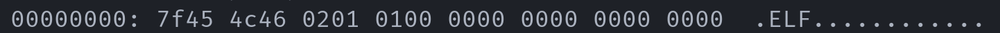
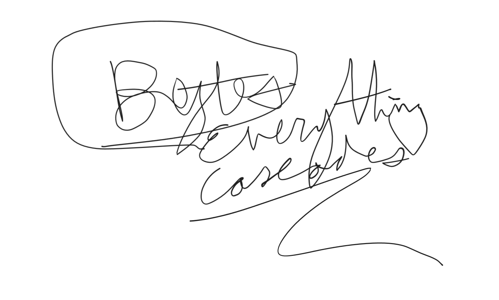

# Part 1

You and your friend Oliver are on an expedition uncovering the secrets of an long-lost alien spaceship belonging to a species referred to by archaeologists as the **sTibs**. The sTibs have developed computer technology way more advanced than ours, however some legacy components are exactly like ours! They also seem to be obsessed with two prime numbers: first 229 and then 83...

While exploring the spaceship you and Oliver find a conveniently human-standard USB flash drive. You decided to plug it in to your computer and read the bytes...

Wait! You notice that the drive stores data for an [ELF file](https://en.wikipedia.org/wiki/Executable_and_Linkable_Format) (~~how convenient that us humans already know what ELF files are~~). You decompile the data and find that the drive contains the following lines of C code:

```c
uint64_t *encrypt(uint64_t a, uint64_t b, char *c)
{
    uint64_t *d = (uint64_t *)malloc(MAX_MESSAGE_LENGTH * sizeof(uint64_t));
    memset(d, 0, MAX_MESSAGE_LENGTH * sizeof(uint64_t));

    for (int i = 0; i < MAX_MESSAGE_LENGTH; i = -~i)
    {
        d[i] = (uint64_t)c[i] * a + b;
        if (i & 1)
        {
            d[i] = (d[i] * b) ^ d[i - 1];
            b = d[i] % 24725;
        }
        else
        {
            a = (d[i] % 251) + 1;
        }
    }

    return d;
}
```

**It seems to be an algorithm of sorts for the aliens to encrypt their messages**.

Going off of intuition, your wonderful friend, Oliver, writes a little program to get some input from the person running the program and the two numbers y'all found before and encrypts a message of your choosing using the function.

There seems to be a lot of text encrypted text on the walls things like:

```
23899 553526 15956 246148116 27301 236249688 11431 20238103 29356 544706648 43577 328150113 43393 1214133889 38738 288802258 24203 354205823 31106 625351918 30384 63330296 11097 115884190 29266 856223002 38493 629051743 32482 680638518 20990 160006694 27019 273984153 25825 116167153 35759 144057172 19588 97479042 14060 177867072 20552 405913953 3628 13162940 9240 85386840 11415 130313606 12856 165273208 11308 127863740 10765 115895972 9897 97959224 23499 552184114 689 474320 4545 20652608
```

_(written in binary with triangles and circles of course)_

However, as Oliver was beginning to write the decryption program for this ancient cipher, he was dragged away by the security system onboard! Before he was dragged away, he managed to scribble on a piece of paper, crumple it up, and throw it to you. The paper says:



The ominous security drone moves way too fast for you to run and catch up with it. However, your computers picked up a radio signal containing the numbers:

```
12449 679478 26550 367957259 33354 864495758 23123 136668471 16628 217446712 18338 240373830 23737 654166664 23819 684684302 46701 611294844 19549 348546868 23268 541409780 6455 41668838 7213 52020164 23489 551722048 8398 70518026 2326 5407986 17936 321685264 13014 169375794 9544 91078920 16745 280378488 21713 471434864 3289 10814248 9423 88800174 12699 161251906 20181 407253996 8521 72599448 6848 46893760 15160 229828472 9597 92109428 8803 77484074 20649 426401592 18967 359728134
```

You figured that these numbers contain information on where your friend is being transferred to... **what does it say?**

The code that y'all discovered and Oliver hacked a little is contained in the file `olivers-code.c`...
